# Lab 09 - Introducción a React
📌 Descripción

En este laboratorio se realizó una introducción al desarrollo de aplicaciones con React, trabajando en equipo para explorar conceptos básicos del framework, configuración del entorno y desarrollo de componentes.

🛠️ Tecnologías utilizadas

React

JavaScript

Node.js

Vite

HTML5

CSS3

✅ Objetivos del laboratorio

Comprender la estructura básica de un proyecto en React.

Crear componentes reutilizables.

Ejecutar una aplicación React utilizando Vite.

Familiarizarse con el entorno de desarrollo frontend.

🚀 Ejecución del proyecto
npm installnpm run dev
👥 Integrantes del equipo
Kevin Quispe Ccolque
Junior Cueva Fabian
Calep Neyra Taype
📷 Evidencias del Laboratorio

# Kevin Quispe Ccolque

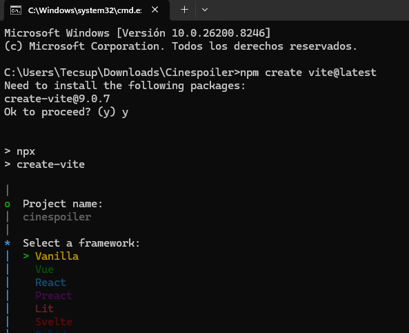
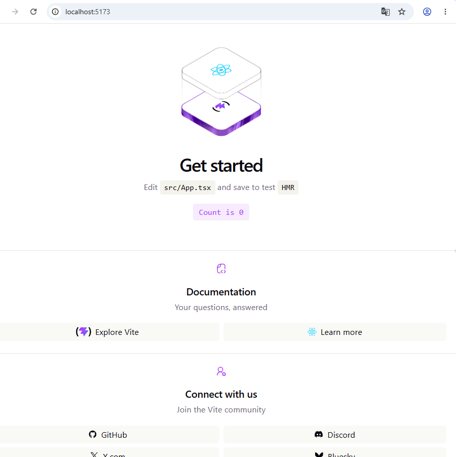
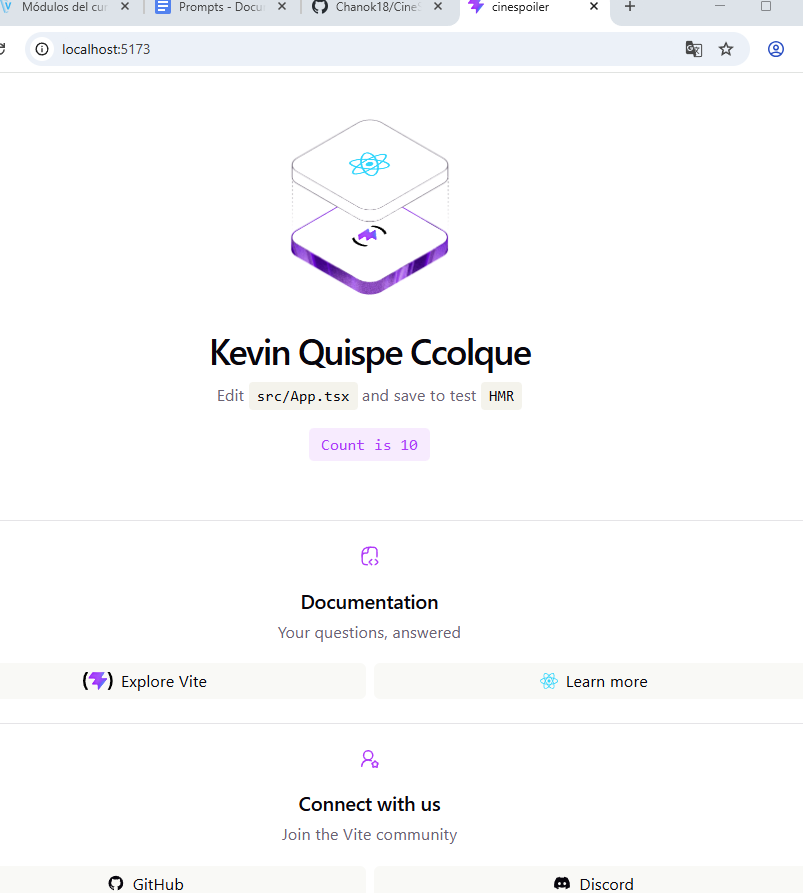
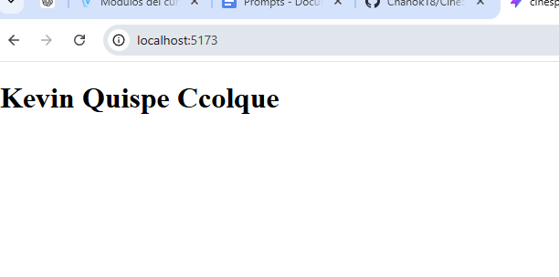
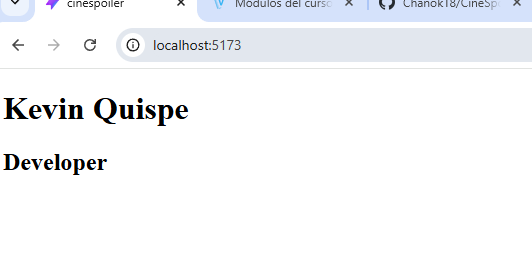

# Junior Cueva Fabian:
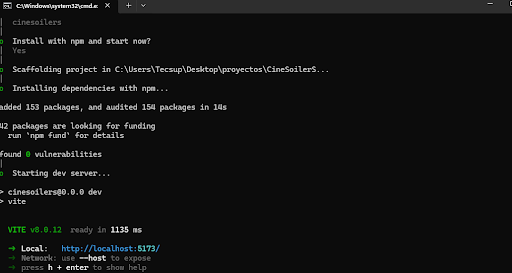
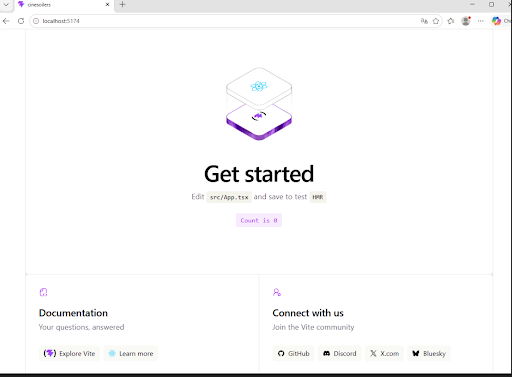
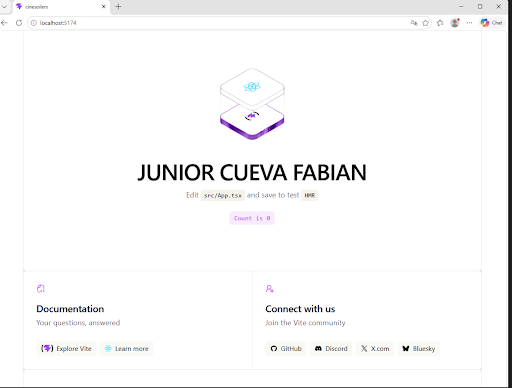
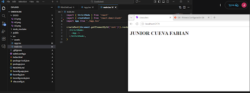
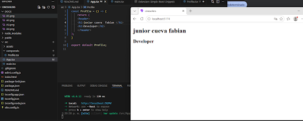
# Calep Neyra Taype:
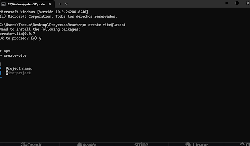
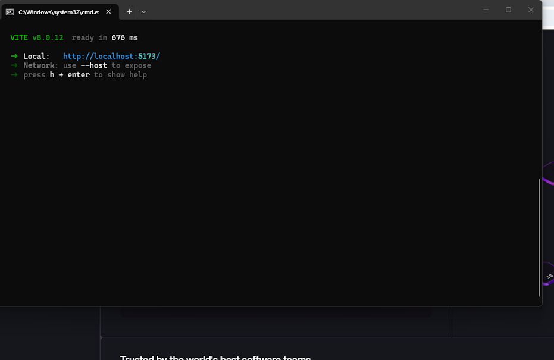
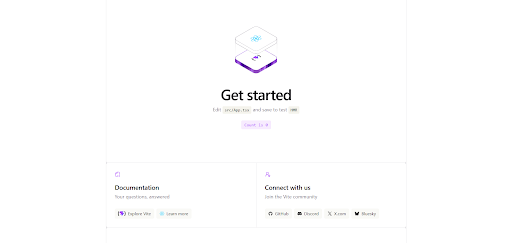
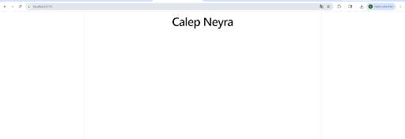
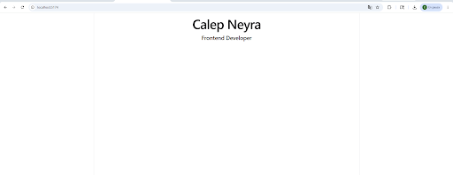